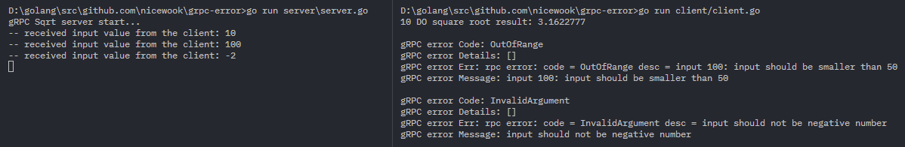

# gRPC Error

Reference Links

- 공식 페이지: https://www.grpc.io/docs/guides/error/
	- 실습 코드: https://github.com/avinassh/grpc-errors/tree/master/go
	- Errors: https://cloud.google.com/apis/design/errors
- 좋은 참고: http://avi.im/grpc-errors/
- 유데미
	- 강좌: https://www.udemy.com/grpc-golang/learn/lecture/11018812#overview
- 실습: https://www.udemy.com/grpc-golang/learn/lecture/11018814#overview

# Let's run
- Terminal 1: go run server/server.go
- Terminal 2: go run client/client.go

